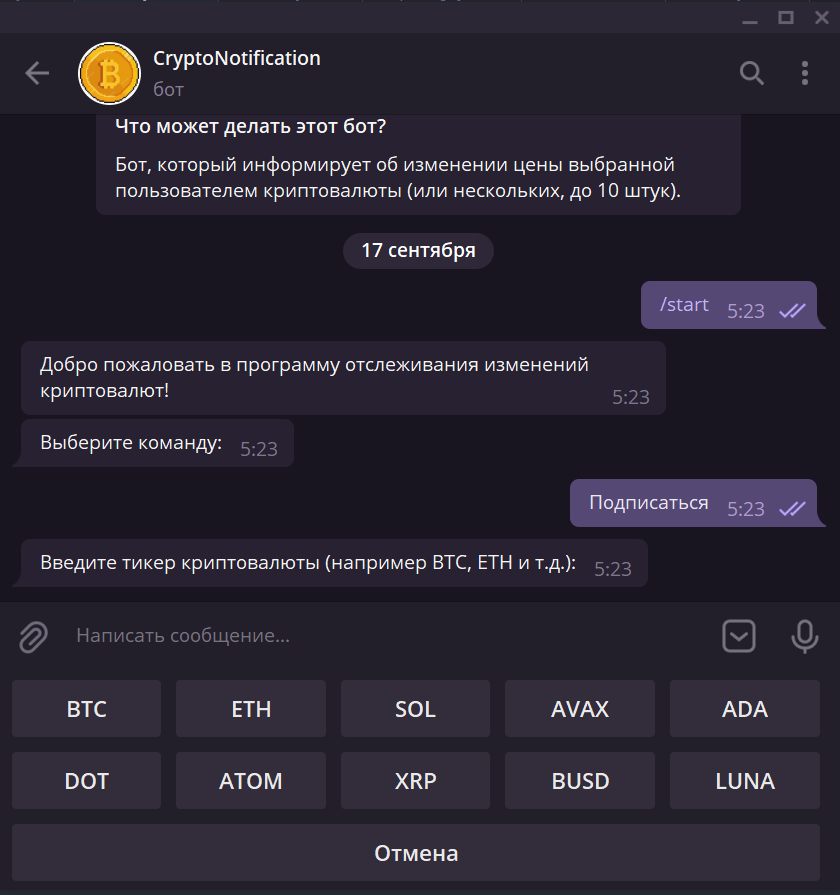
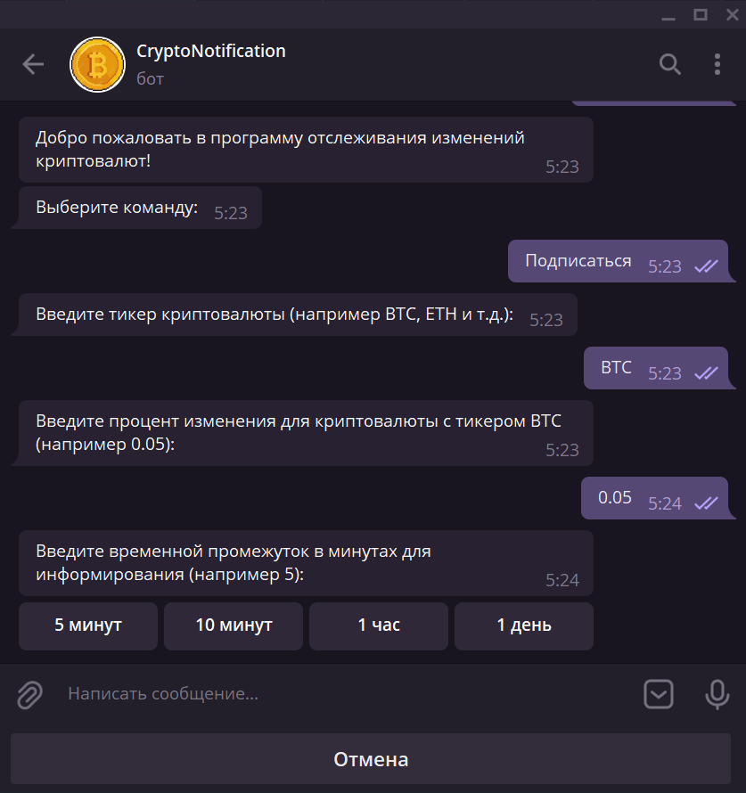
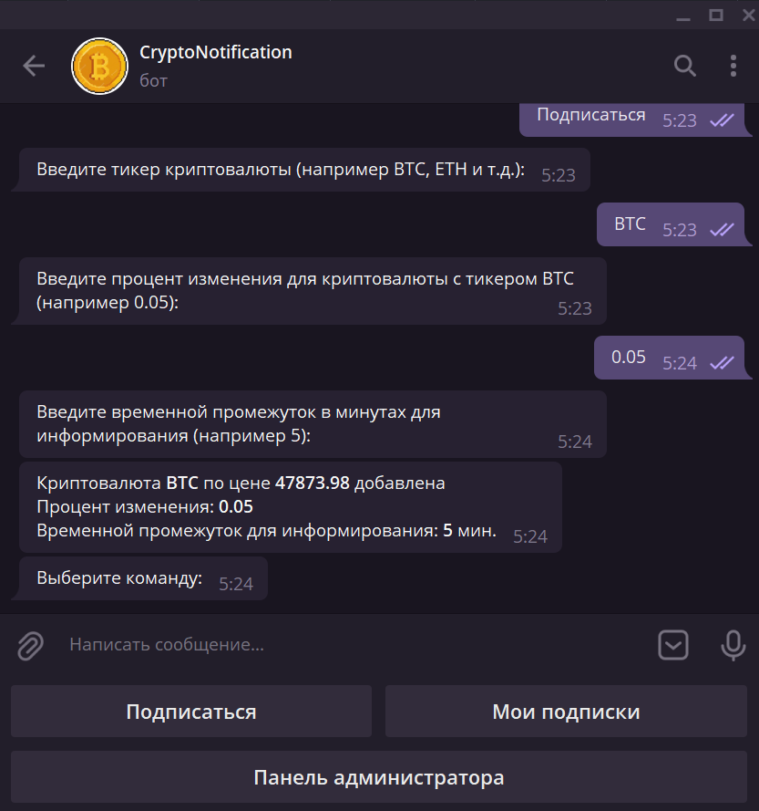
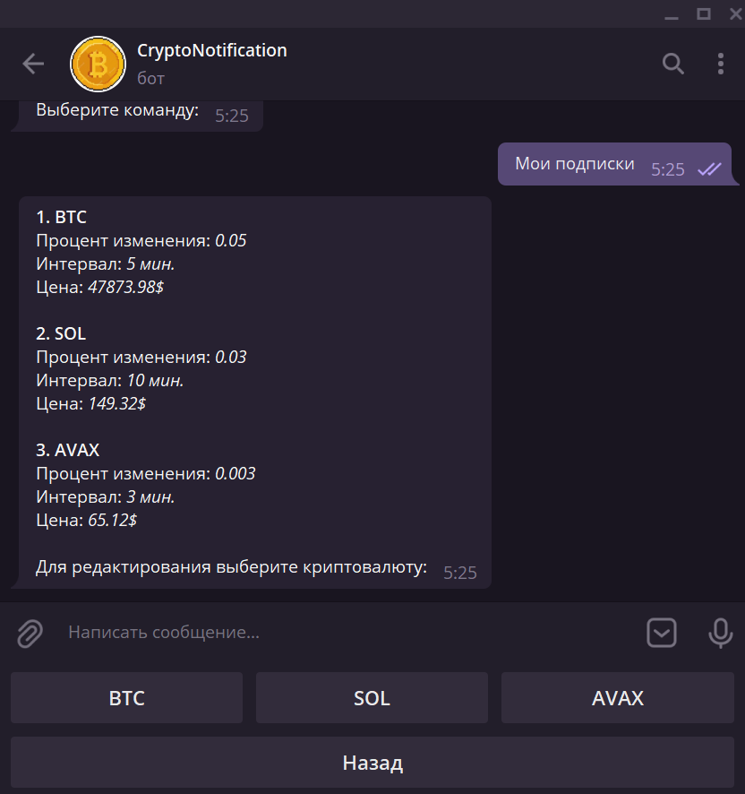
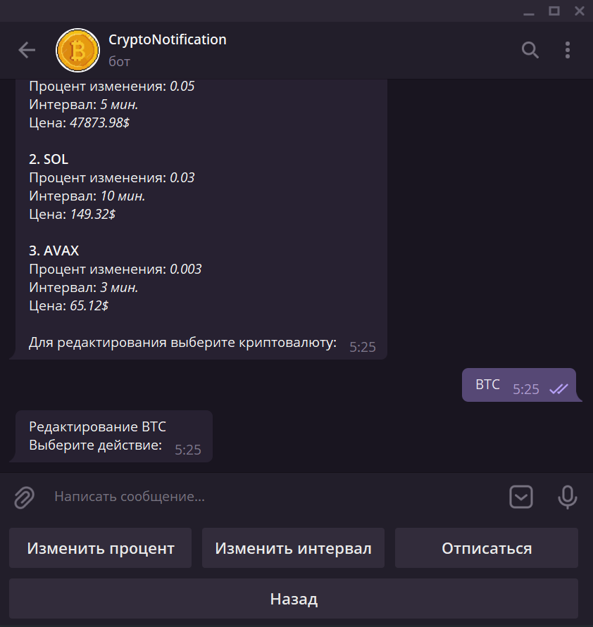
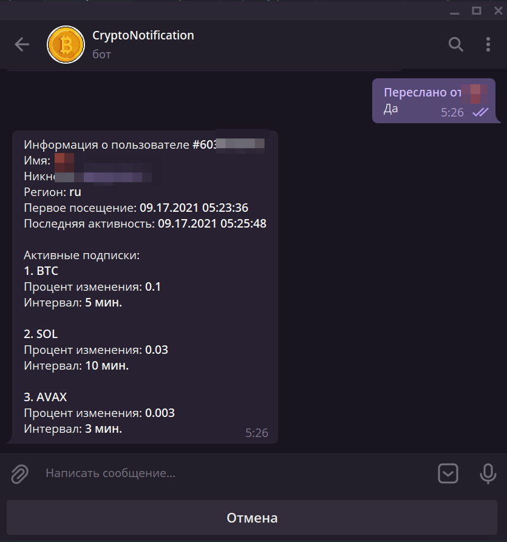
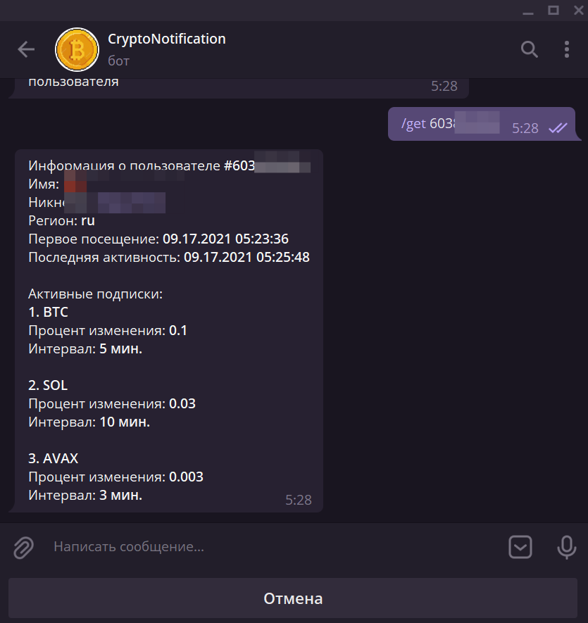
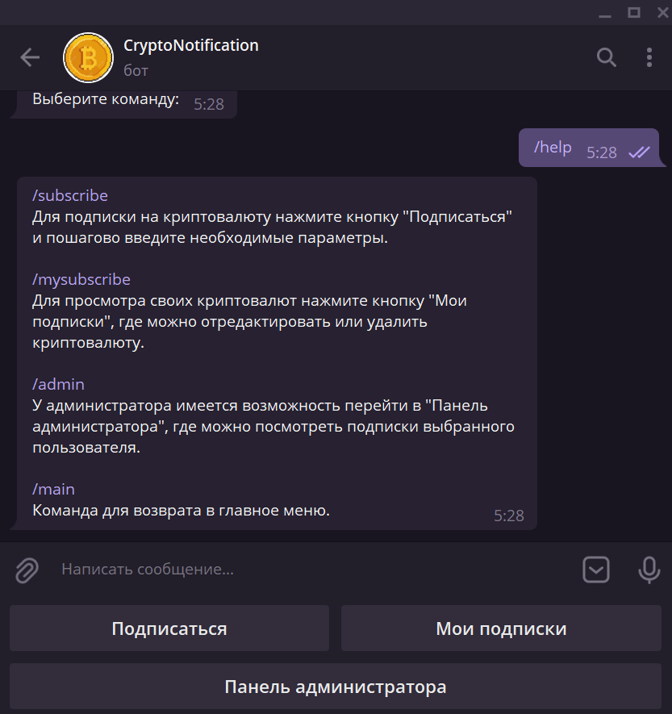
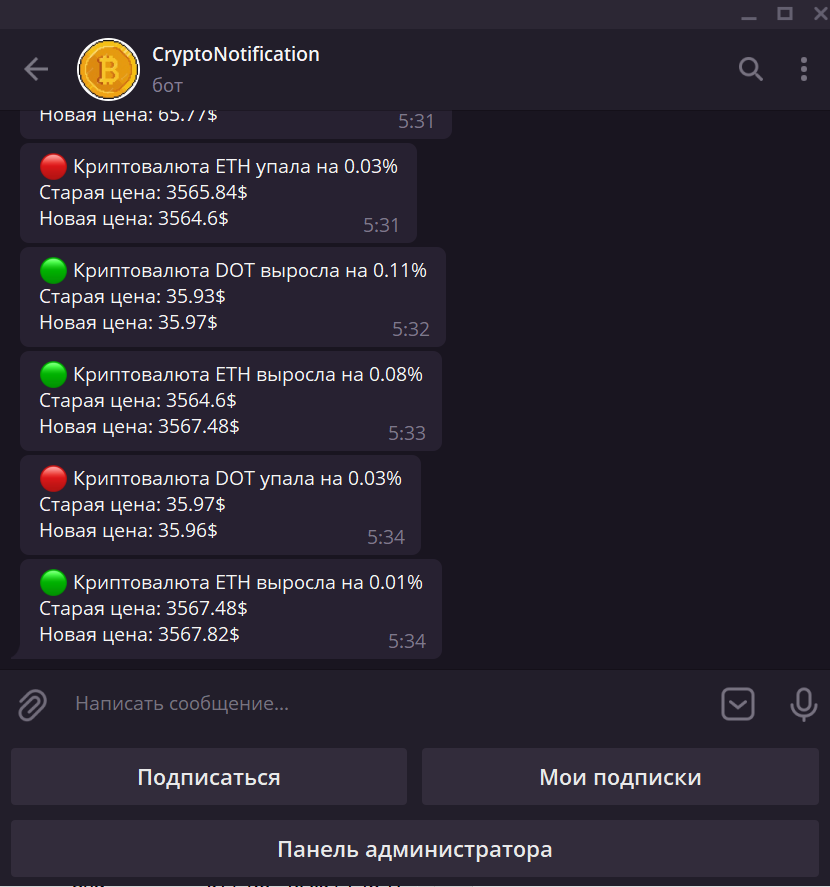

<!-- Иконка -->
 

  

  <h3 align="center">Crypto Notification</h3>

  

    Бот, который информирует об изменении цены выбранной пользователем криптовалюты.
     
  

<!-- О проекте-->
## О проекте

Команды:
/subscribe
Для подписки на криптовалюту нажмите кнопку "Подписаться" и пошагово введите необходимые параметры. 

/mysubscribe
Для просмотра своих криптовалют нажмите кнопку "Мои подписки", где можно отредактировать или удалить криптовалюту.

/admin
У администратора имеется возможность перейти в "Панель администратора", где можно посмотреть подписки выбранного пользователя.

/main
Команда для возврата в главное меню.'

<!-- Результаты работы программы -->
## Результаты работы программы

<!-- Создано с помощью -->
## Создано с помощью

* [Node.js](https://nodejs.org)
* [MongoDB](https://www.mongodb.com)
* [Mongoose](https://mongoosejs.com)
* [Telegraf.js](https://telegraf.js.org/)
* [Moment.js](https://momentjs.com)

